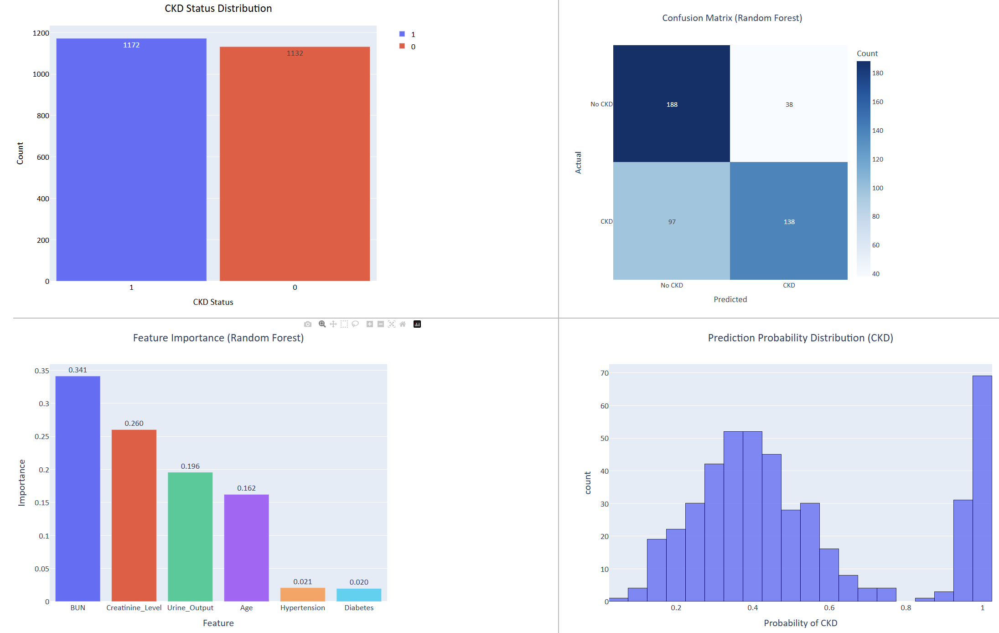

# Kidney Disease Outcome

## Description

This project leverages machine learning to predict the likelihood of chronic kidney disease (CKD) using a clinical dataset. The goal is to assist in early detection of CKD by analyzing relevant patient biomarkers and visualizing key insights through an interactive Plotly/Dash dashboard. The project includes preprocessing, training a model, evaluating performance, and highlighting feature importance.

## Table of Contents 
	
- [Installation](#installation)
- [Usage](#usage)
- [Methodology](#methodology)
- [Results](#results)
- [Conclusion](#conclusion)
- [License](#license)

## 📦 Installation

To run this project locally, follow these steps:

1. Clone the repository:
    ```bash
    git clone https://github.com/CxLos/Kidney_Disease_Outcome
    ```
2. Navigate to the project directory:
    ```bash
    cd Kidney_Disease_Outcome
    ```
3. Install the required dependencies:
    ```bash
    pip install -r requirements.txt
    ```

## ▶️ Usage

- This is an interactive Plotly/Dash dashboard. You can explore different aspects of the data, including class distribution, prediction outcomes, and feature importance. Hover over charts for tooltips and use zoom to inspect data more closely.

- To launch the dashboard locally:
    ```bash
    python kidney_disease.py
    ```

- Or access the live version here:  
  🌐 [Kidney Disease Outcome Dashboard](https://kidney-disease-outcome-fc4ec49235f0.herokuapp.com/)



## 🧪 Methodology

- Dataset: The dataset was sourced from Kaggle. It contains clinical measurements for 2,300+ patients across features like blood pressure, BUN, creatinine, etc.

- **Preprocessing**:
  - Handled missing values and outliers
  - Encoded categorical features
  - Normalized numerical columns

- **Modeling**:
    - Trained a logistic regression classifier
    - Evaluated using accuracy, precision, recall, F1-score
    - Assessed feature importance to understand key drivers of prediction

## Results

## 📊 Model Performance

To evaluate the classification models used for predicting Chronic Kidney Disease (CKD), we compared **Logistic Regression**, **Decision Tree**, and **Random Forest** using five key performance metrics:

- **Accuracy**: Overall correctness of the model.
- **Precision**: When the model predicts CKD, how often is it correct?
- **Recall**: How well does the model identify actual CKD cases?
- **F1 Score**: Harmonic mean of precision and recall, especially useful for imbalanced classes.
- **Jaccard Score**: Measures similarity between predicted and actual labels.

| Model                | Accuracy | Precision | Recall | F1 Score | Jaccard |
|---------------------|----------|-----------|--------|----------|---------|
| Logistic Regression | 0.6247   | 0.6348    | 0.6213 | 0.6280   | 0.4577  |
| Decision Tree       | 0.6616   | 0.6710    | 0.6596 | 0.6652   | 0.4984  |
| Random Forest       | 0.7072   | 0.7841    | 0.5872 | 0.6715   | 0.5055  |

### 🔍 Insights

- **Random Forest** achieved the highest overall performance in accuracy and F1 score, indicating a strong balance between precision and recall.
- **Decision Tree** showed decent performance but slightly lagged behind Random Forest.
- **Logistic Regression** had the lowest scores across most metrics, making it the least effective model in this comparison.


### Feature Importance

The dashboard highlights the most influential features contributing to the model's prediction. This allows users and clinicians to better understand what clinical indicators matter most.

## ✅ Conclusion

This project demonstrates the application of machine learning for health diagnostics. By combining statistical insights with interactive visualizations, it offers a powerful tool for analyzing kidney disease outcomes. Future improvements could include using ensemble models or deploying the app with live patient data integration.

## 📄 License

MIT License

© 2025 CxLos

Permission is hereby granted, free of charge, to any person obtaining a copy
of this software and associated documentation files (the "Software"), to deal
in the Software without restriction, including without limitation the rights
to use, copy, modify, merge, publish, distribute, sublicense, and/or sell
copies of the Software, and to permit persons to whom the Software is
furnished to do so, subject to the following conditions:

The above copyright notice and this permission notice shall be included in all
copies or substantial portions of the Software.

THE SOFTWARE IS PROVIDED "AS IS", WITHOUT WARRANTY OF ANY KIND, EXPRESS OR
IMPLIED, INCLUDING BUT NOT LIMITED TO THE WARRANTIES OF MERCHANTABILITY,
FITNESS FOR A PARTICULAR PURPOSE AND NONINFRINGEMENT. IN NO EVENT SHALL THE
AUTHORS OR COPYRIGHT HOLDERS BE LIABLE FOR ANY CLAIM, DAMAGES OR OTHER
LIABILITY, WHETHER IN AN ACTION OF CONTRACT, TORT OR OTHERWISE, ARISING FROM,
OUT OF OR IN CONNECTION WITH THE SOFTWARE OR THE USE OR OTHER DEALINGS IN THE
SOFTWARE.